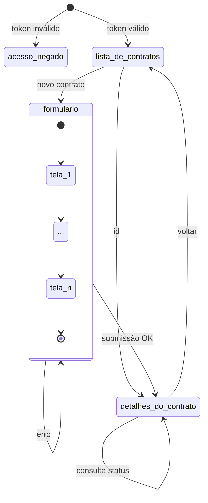
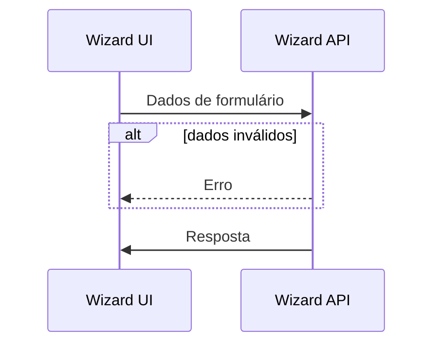
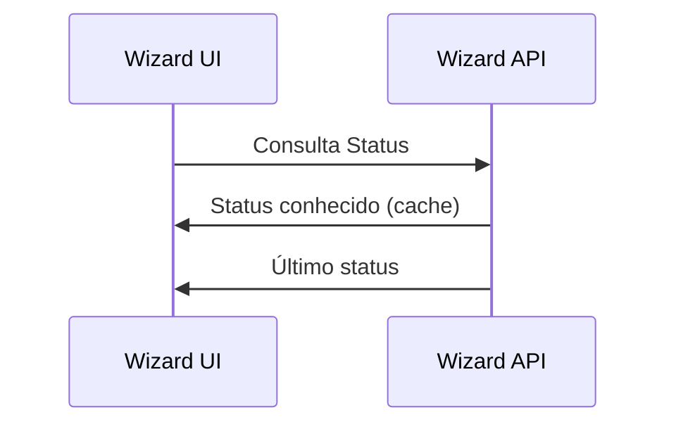

# Wizard UI

Uma interface web genérica para a configuração inicial (contratação) de qualquer coisa.

# Tecnologias

- [Node.js](https://nodejs.org/) v16.x
- [Next.js](https://nextjs.org/)

# Development server

```
# install
yarn
# launch dev server on localhost:3000
yarn dev
```

# Contribuições

Este repositório pode estar espelhado em outros lugares, para contribuir com melhorias ou relatar
problemas, utilize a página deste projeto no Github: https://github.com/jaxyendy/wizard-ui

Se você está lendo este README fora do Github, não deixe de ler também o
arquivo [DISTRO.md](DISTRO.md).

# Licença

A definir.
<small>(gostamos muito da AGPL3, mas MIT pode ser mais flexível)</small>


## Fluxos

### Telas da UI



### Wizard API

[Wizard API](https://github.com/jaxyendy/wizard-api) é o Backend (BFF) deste projeto, abaixo alguns
fluxos que envolvem comunicação entre este projeto e seu backend.

#### Contratação



#### Consulta



