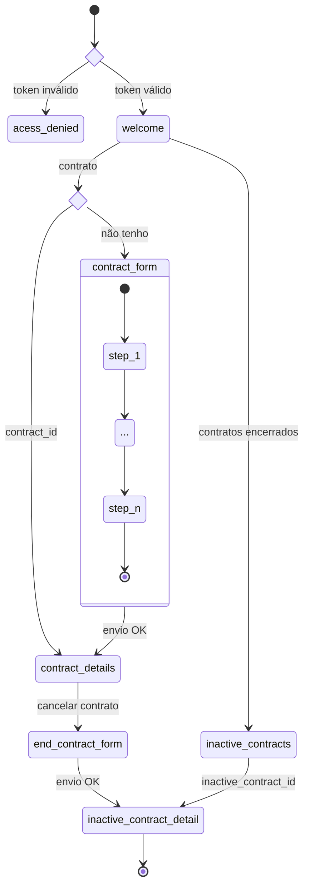

# Wizard UI

Uma interface web genérica para a configuração inicial (contratação) de qualquer coisa.

# Tecnologias

- [Node.js](https://nodejs.org/) v16.x
- [Next.js](https://nextjs.org/)
- [chakra](https://chakra-ui.com/)
- [next-intl](https://next-intl-docs.vercel.app/)

# Development server

```
# install
yarn
# launch dev server on localhost:3000
yarn dev
```

# Contribuições

Este repositório pode estar espelhado em outros lugares, para contribuir com melhorias ou relatar
problemas, utilize a página deste projeto no Github: https://github.com/jaxyendy/wizard-ui

Se você está lendo este README fora do Github, não deixe de ler também o
arquivo [DISTRO.md](DISTRO.md).

# Licença

A definir.
<small>(gostamos muito da AGPL3, mas MIT pode ser mais flexível)</small>


## Fluxos

### Telas da UI



## Biblioteca de Componentes

Este projeto, além de ser um site NextJS, é também uma biblioteca dos componentes usados por este
site.

A lista dos componentes exportados pode ser vista no arquivo `/lib/index.ts`.

Este pacote npm é exportado sem transpilação, portanto para utilizar estes componentes em
um outro projeto NextJS recomendamos o uso do plugin
[next-transpile-modules](https://github.com/martpie/next-transpile-modules) ou alguma outra
técnica similar.

Para ajudar com o teste e desenvolvimento de componentes em conjunto com outros projetos NextJS
localmente, antes da publicação no registry npm, uma ferramenta como o
[yalc](https://github.com/wclr/yalc) pode também ser útil.
