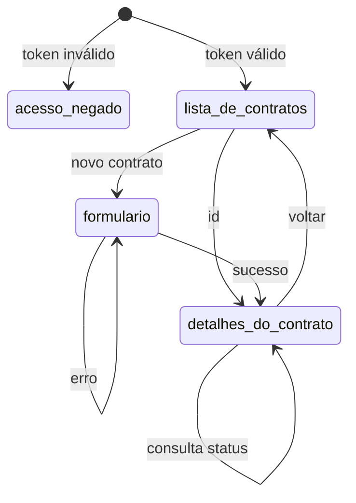
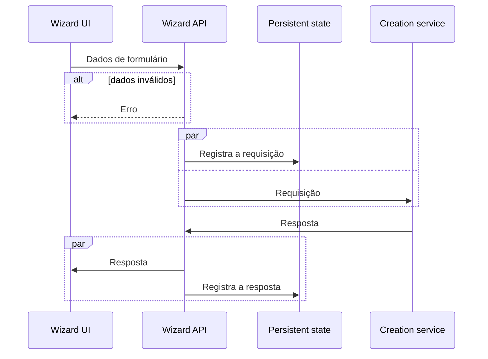
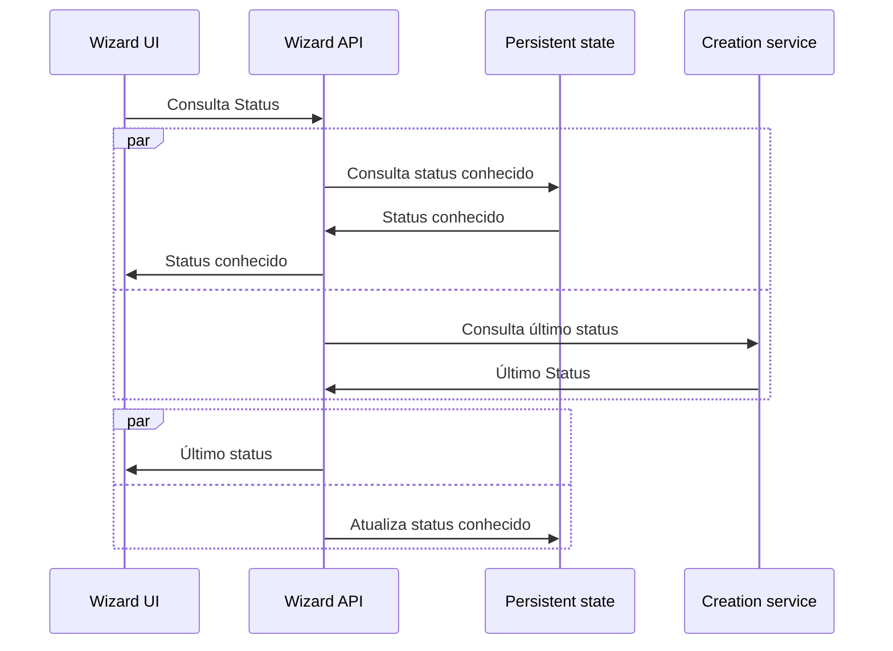

# Wizard UI

Uma interface web genérica para a configuração inicial (contratação) de qualquer coisa.

# Tecnologias

- [Node.js](https://nodejs.org/) v16.x
- [Next.js](https://nextjs.org/)

# Development server

```
# install
yarn
# launch dev server on localhost:3000
yarn dev
```

## Fluxos

### Telas da UI



### Wizard API

[Wizard API](https://github.com/jaxyendy/wizard-ui) é o Backend (BFF) deste projeto, abaixo alguns
fluxos que envolvem comunicação entre este projeto e seu backend.

Esta API é "stateless" e por sua vez conversa com um outro serviço (Persistent state) para
armazenar o log das requisições e respostas ao serviço (Creation service) que de fato cria a "coisa" 
contratada.

#### Contratação



#### Consulta



